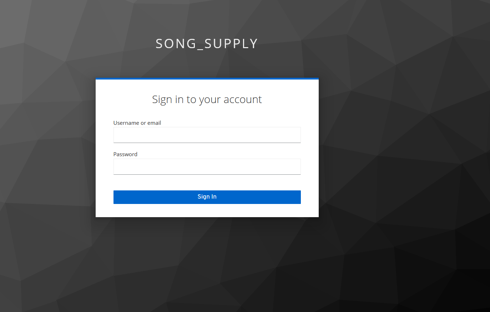
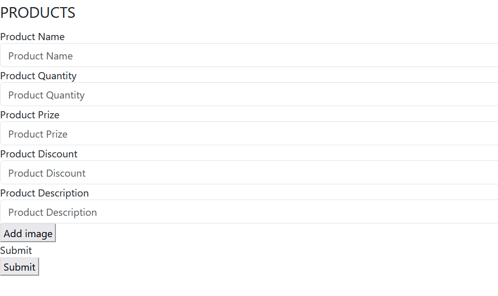
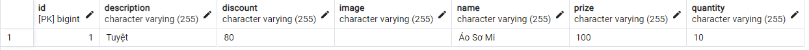
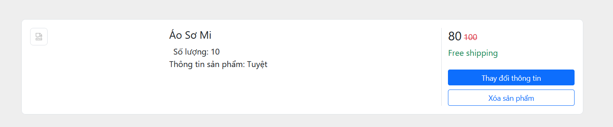
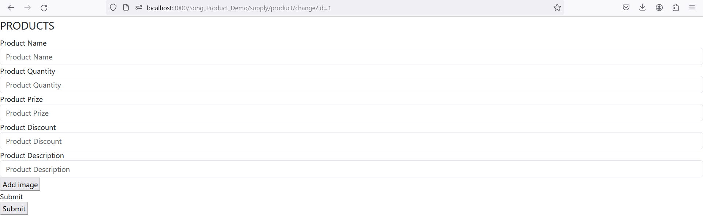

# Basic Web

This project is about basic concept of Web development. In this project, I learned basic FE app with React and basic concept of how to handle request, manage database, Authorization with Java Spring Boot

The scenario is basic function when User try to communicate with Shop, the shop basically update and manage their products 

<b> Setup Project</b>

With the flexibility of project, I use docker to handle all the server I need on it. The docker file is in test folder.
You can go to terminal and get it work with <b>docker compose up</b>

<b> Eureka Server </b>
It's one of easy way to control the service is in process and the request send between them. We can config it with annotation EnableEurekaServer in the service we want to keep track with Eureka

<b> Authorization</b>

Using keycloak endpoint to manage access session, we can use the client information with Keycloak endpoint. We can add auth provider with Github, Google,...

After user/supply login, every request from user/supply can send with bearer+access token, in backend we can config for server to serve the request which have right access token.

<b>API Gateway</b>

This is simple that we hide the ip of the actual backend with a gateway. The request wil send to this gateway with ip and port and then will be transport to the actual server that we config for the uri request. We can config basic function for every request here like CORS or authorize.

<b> REST API and CRUD operation</b>

Database: We can config and build up database from backend, in more complicated project, we must follow the rule of Normalization Form. The code may have add the relation one-to-one, one-to-many, many-to-many to get better performance.

**Create**: We can add more product from fe interface and it will store data to database.

After add product, we can query it from database to see the update of table :

**Read**: It is when we fetch data to the webpage or read data from database

**Update**: We can update and notify which product need to update with id in the url

**Delete**: We can erase the product through id of product.

