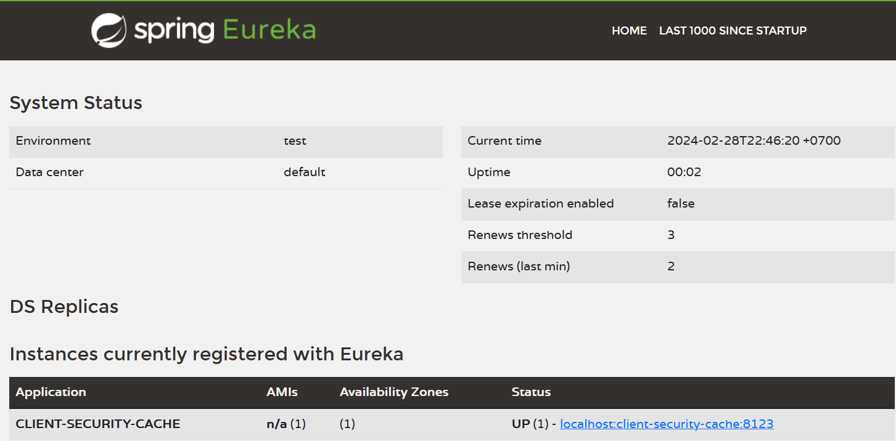

# Basic Web

This project is about basic concept of Web development. In this project, I learned basic FE app with React and basic concept of how to handle request, manage database, Authorization with Java Spring Boot

The scenario is basic function when User try to communicate with Shop, the shop basically update and manage their products 

<b> Setup Project</b>

With the flexibility of project, I use docker to handle all the server I need on it. The docker file is in test folder.
You can go to terminal and get it work with <b>docker compose up</b>

<b> Eureka Server </b>
It's one of easy way to control the service is in process and the request send between them. We can config it with annotation EnableEurekaServer in the service we want to keep track with Eureka

